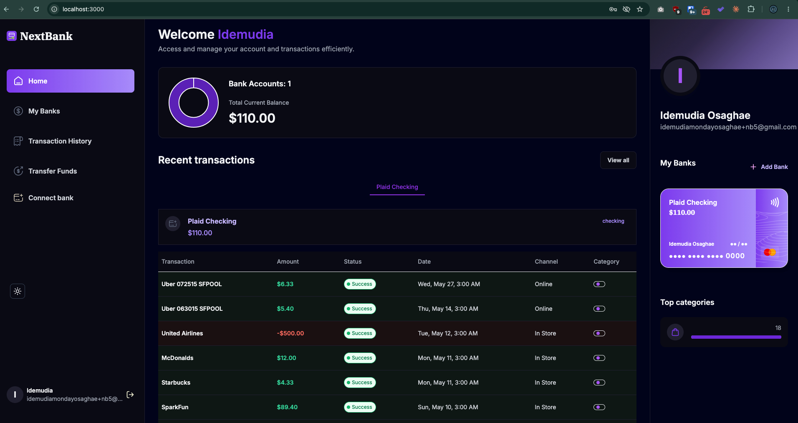

# NextBank

A full-stack fintech dashboard for connecting real bank accounts, viewing balances and transaction history, and transferring funds between users. Built with Next.js 14 and TypeScript, integrating Appwrite for authentication and data, Plaid for bank connectivity, and Dwolla for ACH transfers.


---

## Live demo

**[nextbank.idemudia.dev](https://nextbank.idemudia.dev)**

To explore the linked-bank flow, use Plaid's standard sandbox credentials when prompted:

- Username: `user_good`
- Password: `pass_good`

> The application runs against the **sandbox** environments of Plaid and Dwolla. No real money moves; sandbox transfers settle in a simulated "processing" state, mirroring real ACH timing.

## Overview

NextBank is a single-page banking experience that brings several financial APIs together behind a clean dashboard. A user signs up, securely links one or more real bank accounts through Plaid, and can then view consolidated balances, browse categorised transaction history, and send funds to another user via Dwolla's ACH rails.

The project demonstrates end-to-end integration of third-party financial services, server-side data handling with Appwrite, and a typed, component-driven frontend.

## Screenshots




## Key features

- **Authentication** — secure sign-up and sign-in with server-side session handling via Appwrite.
- **Bank linking** — connect real bank accounts through the Plaid Link flow, with a Dwolla funding source created for each linked account.
- **Account dashboard** — consolidated view of connected accounts, total balance, and recent transactions.
- **My Banks** — a detailed list of all connected accounts.
- **Transaction history** — paginated, categorised transactions per account.
- **Payment transfer** — send funds to another user using Dwolla ACH transfers.
- **Responsive UI** — a mobile-first interface built with Tailwind CSS that adapts across mobile, tablet, and desktop.

## Tech stack

| Layer | Technology |
|---|---|
| Framework | Next.js 14 (App Router), React, TypeScript |
| Styling | Tailwind CSS |
| Auth & data | Appwrite (authentication, database) |
| Bank connectivity | Plaid |
| Payments | Dwolla (ACH transfers) |
| Validation | Zod, React Hook Form |
| Charts | Chart.js |
| Deployment | Vercel |

## Architecture

The application follows the Next.js App Router model, with server actions handling all sensitive operations:

- **Server actions** (`lib/actions/*`) — encapsulate every privileged call (Appwrite reads/writes, Plaid token exchange, Dwolla customer and transfer creation). Secrets never reach the client.
- **Appwrite backend** — three collections model the domain: `users`, `banks`, and `transactions`.
- **Plaid** — handles the bank-link handshake and returns access tokens, which are exchanged server-side.
- **Dwolla** — each linked account is registered as a funding source, enabling transfers between users.

This separation keeps all credentials and tokens on the server, with the client receiving only the data it needs to render.

## Security

Security is treated as a first-class concern, particularly given the financial domain:

- **No secrets in the repository.** All credentials are supplied through environment variables and are excluded via `.gitignore`. A committed `.env.example` documents the required variables with empty placeholders.
- **Server-side secret handling.** API keys and access tokens are used only inside server actions and are never exposed to the browser.
- **Scoped API access.** The Appwrite server key is limited to the minimum scopes required (Auth and Databases).
- **Sandbox isolation.** Plaid and Dwolla run in sandbox mode, so no production financial data or funds are involved.

## My contributions

This project began as a guided build following the JS Mastery banking tutorial (see Acknowledgements). On top of that foundation, I independently carried out substantial engineering work:

- **Rebuilt the backend on my own infrastructure** — a fresh Appwrite project with `users`, `banks`, and `transactions` collections, and scoped server API keys.
- **Migrated the Plaid and Dwolla integrations** onto my own sandbox accounts, including credential rotation and the Plaid-Dwolla integration setup.
- **Fixed an Appwrite 1.9.5 compatibility bug** in `getBank`, switching from a query-based lookup to a direct document fetch.
- **Hardened the project's security posture** — moved all secrets to environment variables, removed an unused error-monitoring integration, and reduced reported dependency vulnerabilities through targeted, non-breaking upgrades.
- **Resolved UI defects and improved responsiveness** — corrected React list keys, fixed a null-reference crash on the home route, made the logout control and transactions table responsive across breakpoints, and applied a custom brand identity (logo, colour theme, typography).
- **Deployed and configured the live site** on Vercel with a custom domain.

## Getting started

### Prerequisites

- Node.js 18 or later
- An [Appwrite](https://appwrite.io) project with `users`, `banks`, and `transactions` collections
- A [Plaid](https://plaid.com) account (sandbox)
- A [Dwolla](https://www.dwolla.com) account (sandbox)

### Installation

```bash
git clone https://github.com/engr-idemudia/NextBank.git
cd NextBank
npm install
```

### Environment variables

Create a `.env` file in the project root using `.env.example` as a template, then fill in your own values:

```bash
cp .env.example .env
```

| Variable | Description |
|---|---|
| `NEXT_PUBLIC_SITE_URL` | Base URL of the app (e.g. `http://localhost:3000`) |
| `NEXT_PUBLIC_APPWRITE_ENDPOINT` | Appwrite API endpoint |
| `NEXT_PUBLIC_APPWRITE_PROJECT` | Appwrite project ID |
| `APPWRITE_DATABASE_ID` | Appwrite database ID |
| `APPWRITE_USER_COLLECTION_ID` | Users collection ID |
| `APPWRITE_BANK_COLLECTION_ID` | Banks collection ID |
| `APPWRITE_TRANSACTION_COLLECTION_ID` | Transactions collection ID |
| `NEXT_APPWRITE_KEY` | Appwrite server API key (Auth + Databases scopes) |
| `PLAID_CLIENT_ID` | Plaid client ID |
| `PLAID_SECRET` | Plaid sandbox secret |
| `PLAID_ENV` | Plaid environment (`sandbox`) |
| `PLAID_PRODUCTS` | Requested Plaid products (e.g. `auth,transactions`) |
| `PLAID_COUNTRY_CODES` | Supported country codes (e.g. `US,CA`) |
| `DWOLLA_KEY` | Dwolla API key |
| `DWOLLA_SECRET` | Dwolla API secret |
| `DWOLLA_BASE_URL` | Dwolla API base URL (`https://api-sandbox.dwolla.com`) |
| `DWOLLA_ENV` | Dwolla environment (`sandbox`) |

> Never commit your `.env` file. Treat any credential that reaches version control as compromised and rotate it.

### Running locally

```bash
npm run dev
```

The app will be available at `http://localhost:3000`.

## Project structure## Acknowledgements

This application was built by following the open banking tutorial by [Adrian Hajdin - JS Mastery](https://github.com/adrianhajdin), and extended with the additional work described above. The original project is MIT-licensed, and that license is preserved in this repository.

## Author

**Idemudia M. Osaghae** - Software Engineer (backend, fintech, security)
Tallinn, Estonia

- Portfolio: [idemudia.dev](https://idemudia.dev)
- GitHub: [engr-idemudia](https://github.com/engr-idemudia)

## License

This project is released under the MIT License, with copyright retained by the original author (Adrian Hajdin - JS Mastery) and additional modifications by Idemudia M. Osaghae. See [`LICENSE`](LICENSE) for details.
